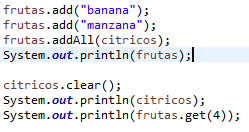



||
**UNIVERSIDAD NACIONAL DE SAN AGUSTIN**

**FACULTAD DE INGENIERÍA DE PRODUCCIÓN Y SERVICIOS**

**ESCUELA PROFESIONAL DE INGENIERÍA DE SISTEMA**
||
| :-: | :-: | :-: |
|**Formato:** Guía de Práctica de Laboratorio / Talleres / Centros de Simulación|
|**Aprobación:  2022/03/01**|**Código: GUIA-PRLE-001**|**Página: 1**|

**INFORME DE LABORATORIO**

|**INFORMACIÓN BÁSICA**|
| :-: |
|**ASIGNATURA:** |`	`Estructura de Datos y Algoritmos|
|**TÍTULO DE LA PRÁCTICA:** |Revisión de elementos de programación (Parte I)|
|**NÚMERO DE PRÁCTICA:**|02|**AÑO LECTIVO:**|2022 A|**NRO. SEMESTRE:**|III|
|**FECHA DE PRESENTACIÓN**|10-May-2022|**HORA DE PRESENTACIÓN**|22:50|
|
**INTEGRANTE (s):** 

Vizcarra Gallegos Elias Eduardo – evizcarraga@unsa.edu.pe

|**NOTA:**||
|
**DOCENTE(s):**

Richart Smith Escobedo Quispe - rescobedoq@unsa.edu.pe

|

|**SOLUCIÓN Y RESULTADOS**|
| :-: |
|
I. **SOLUCIÓN DE EJERCICIOS/PROBLEMAS**

1. **Invertir un matriz de enteros (2 pts):**

La solución de este ejercicio es muy simple, tan solo debemos crear una variable int p que sea igual al tamaño del arreglo inicial-1 y luego un bucle for each que para cada elemento del array inicial coloque ese valor en el arreglo invertido con índice p, al final de cada bucle a la variable p se le resta 1.

2. **Rotación a la Izquierda (3 pts):**

En este caso se puede resolver con un bucle for() y un if..else. En este caso es mejor usar for que for each ya que nos interesa utilizar el valor de i.

3. **Triángulo recursivo (4 pts):** 

Este ejercicio se soluciona creando 2 bucles for anidados, de manera que el for interior imprimirá \* cuantas veces sea necesario por línea y el for exterior controla las repeticiones del for interior y también coloca un salto de línea con cada iteración, repitiéndose hasta llegar al número base o base del triángulo.

4. **Lista (11 pts):**

En este ejercicio se implementó una lista usando POO, en este caso se creó un arrayList de Strings llamado ‘frutas’ junto con otro arrayList “cítricos” y se utilizaron algunos de los métodos de la interface List.

 
|
|
II. **SOLUCIÓN DEL CUESTIONARIO**

- **¿Qué diferencia hay entre un List y un ArrayList en Java?**

Un List es una interface, que se extiende de la interface Collection, mientras que ArrayList es una de las 3 clases que implementan la interface List. 

- **¿Qué beneficios y oportunidades ofrecen las clases genéricas en Java?**

Al utilizar las clases genéricas en lugar de nombres comunes de variables evitamos muchas confusiones y problemas al entender el código. De la misma manera es una manera de escribir menos y darle más orden a una clase creada.

|
|
III. **CONCLUSIONES**

En este laboratorio exploramos los Tipos de Datos Abstractos (TAD), los arrays y arrayLists, la interface List y sus métodos, las clases genéricas y sus convencionalidades. 

Podemos diferenciar un List de un ArrayList y entender que en lugar de crear simples atributos en una clase podemos instanciar tipos genéricos que al declarar los objetos correspondientes podremos asignar el tipo de dato más conveniente para usar.

|

|**RETROALIMENTACIÓN GENERAL**|
| :-: |
|

|

|**REFERENCIAS Y BIBLIOGRAFÍA**|
| :-: |
|
*- https://www.w3schools.com/java/*

*- https://www.eclipse.org/downloads/packages/release/2022-03/r/eclipse-ide-enterprise-java-and-web-developers*

*- https://docs.oracle.com/javase/7/docs/api/java/util/List.html*

*- https://docs.oracle.com/javase/tutorial/java/generics/types.html*
|

